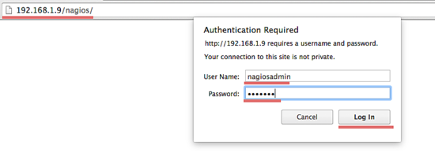
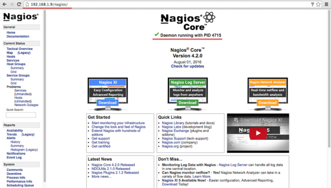
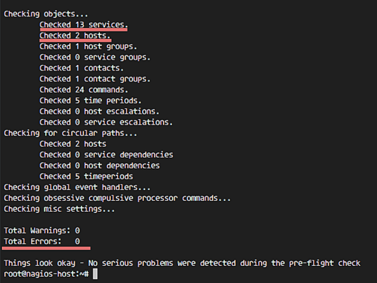
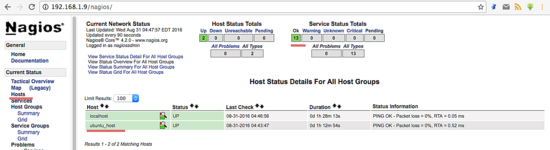
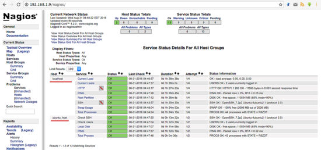

# How to install nagios for Ubuntu 16.04 LTS

````
$ sudo apt-get install wget build-essential apache2 php apache2-mod-php7.0 php-gd libgd-dev sendmail unzip
````

## User and group configuration
#### For Nagios to run, you have to create a new user for Nagios. We will name the user "nagios" and additionally create a group named "nagcmd". 
#### We add the new user to the group as shown below:
````
sudo useradd nagios
sudo groupadd nagcmd
sudo usermod -a -G nagcmd nagios
sudo usermod -a -G nagios,nagcmd www-data
````

## Installing Nagios

### Step 1 - Download and extract the Nagios core
````
cd ~
#wget https://assets.nagios.com/downloads/nagioscore/releases/nagios-4.2.0.tar.gz
wget https://assets.nagios.com/downloads/nagioscore/releases/nagios-4.3.2.tar.gz
tar -xzf nagios*.tar.gz
cd nagios-4.3.2
````

### Step 2 - Compile Nagios
Before you build Nagios, you will have to configure it with the user and the group you have created earlier.
````
./configure --with-nagios-group=nagios --with-command-group=nagcmd
````

#### How to install Nagios
````
make all
sudo make install
sudo make install-commandmode
sudo make install-init
sudo make install-config
sudo /usr/bin/install -c -m 644 sample-config/httpd.conf /etc/apache2/sites-available/nagios.conf
````

#### Copy eventhandler directory to the nagios directory:
````
sudo cp -R contrib/eventhandlers/ /usr/local/nagios/libexec/
sudo chown -R nagios:nagios /usr/local/nagios/libexec/eventhandlers
````

### Step 3 - Install the Nagios Plugins

Download and extract the Nagios plugins:
````
cd ~
wget https://nagios-plugins.org/download/nagios-plugins-2.2.1.tar.gz
#wget https://nagios-plugins.org/download/nagios-plugins-2.1.2.tar.gz
tar -xzf nagios-plugins*.tar.gz
cd nagios-plugin-2.2.1/
````

Install the Nagios plugin's with the commands below:
````
./configure --with-nagios-user=nagios --with-nagios-group=nagios --with-openssl
make
sudo make install
````

### Step 4 - Configure Nagios
After the installation phase is complete, you can find the default configuration of Nagios in /usr/local/nagios/.

We will configure Nagios and Nagios contact.

Edit default nagios configuration with vim:

````
vim /usr/local/nagios/etc/nagios.cfg

uncomment line 51 for the host monitor configuration.
cfg_dir=/usr/local/nagios/etc/servers
Save and exit.
````

Add a new folder named servers:
````
sudo mkdir -p /usr/local/nagios/etc/servers
````

The Nagios contact can be configured in the contact.cfg file.

Replace the default email with your own email.
````
sudo vi /usr/local/nagios/etc/objects/contacts.cfg
````

## Configuring Apache
### Step 1 - enable Apache modules
````
sudo a2enmod rewrite
sudo a2enmod cgi
````

You can use the htpasswd command to configure a user nagiosadmin for the nagios web interface
````
sudo htpasswd -c /usr/local/nagios/etc/htpasswd.users nagiosadmin
````
and type your password.

### Step 2 - enable the Nagios virtualhost
````
sudo ln -s /etc/apache2/sites-available/nagios.conf /etc/apache2/sites-enabled/
````

### Step 3 - Start Apache and Nagios
````
service apache2 restart
service nagios start
````

When Nagios starts, you may see the following error :
````
Starting nagios (via systemctl): nagios.serviceFailed
````
And this is how to fix it:
````
cd /etc/init.d/
cp /etc/init.d/skeleton /etc/init.d/nagios
````

Now edit the Nagios file:
````
sudo vi /etc/init.d/nagios
````

... and add the following code:
````
DESC="Nagios"
NAME=nagios
DAEMON=/usr/local/nagios/bin/$NAME
DAEMON_ARGS="-d /usr/local/nagios/etc/nagios.cfg"
PIDFILE=/usr/local/nagios/var/$NAME.lock
````

Make it executable and start Nagios:
````
sudo chmod +x /etc/init.d/nagios
sudo chown root:root /etc/init.d/nagios
sudo service apache2 restart
service nagios start
sudo service nagios start

sudo update-rc.d nagios defaults
sudo update-rc.d nagios enable
````

## Testing the Nagios Server
Please open your browser and access the Nagios server ip, in my case: http://127.0.0.1/nagios

Nagios Login with apache htpasswd.



Nagios Admin Dashboard



## Adding a Host to Monitor
In this tutorial, I will add an Ubuntu host to monitor to the Nagios server we have made above.

Nagios Server IP : 10.100.x.x
Ubuntu Host IP : 192.168.1.10

### Step 1 - Connect to ubuntu host
````
ssh root@192.168.1.10
````

### Step 2 - Install NRPE Service
````
sudo apt-get install nagios-nrpe-server nagios-plugins
````
### Step 3 - Configure NRPE

After the installation is complete, edit the nrpe file /etc/nagios/nrpe.cfg:
````
sudo vi /etc/nagios/nrpe.cfg
````

... and add Nagios Server IP 192.168.1.9 to the server_address.
````
server_address=10.100.x.x
````

### Step 4 - Restart NRPE
````
sudo service nagios-nrpe-server restart
````

### Step 5 - Add Ubuntu Host to Nagios Server

Please connect to the Nagios server:
ssh root@10.100.x.x

Then create a new file for the host configuration in /usr/local/nagios/etc/servers/.
sudo vi /usr/local/nagios/etc/servers/ubuntu_host.cfg

Add the following lines:
````
# Ubuntu Host configuration file

define host {
        use                          linux-server
        host_name                    ubuntu_host
        alias                        Ubuntu Host
        address                      192.168.1.10
        register                     1
}

define service {
      host_name                       ubuntu_host
      service_description             PING
      check_command                   check_ping!100.0,20%!500.0,60%
      max_check_attempts              2
      check_interval                  2
      retry_interval                  2
      check_period                    24x7
      check_freshness                 1
      contact_groups                  admins
      notification_interval           2
      notification_period             24x7
      notifications_enabled           1
      register                        1
}

define service {
      host_name                       ubuntu_host
      service_description             Check Users
      check_command           check_local_users!20!50
      max_check_attempts              2
      check_interval                  2
      retry_interval                  2
      check_period                    24x7
      check_freshness                 1
      contact_groups                  admins
      notification_interval           2
      notification_period             24x7
      notifications_enabled           1
      register                        1
}

define service {
      host_name                       ubuntu_host
      service_description             Local Disk
      check_command                   check_local_disk!20%!10%!/
      max_check_attempts              2
      check_interval                  2
      retry_interval                  2
      check_period                    24x7
      check_freshness                 1
      contact_groups                  admins
      notification_interval           2
      notification_period             24x7
      notifications_enabled           1
      register                        1
}

define service {
      host_name                       ubuntu_host
      service_description             Check SSH
      check_command                   check_ssh
      max_check_attempts              2
      check_interval                  2
      retry_interval                  2
      check_period                    24x7
      check_freshness                 1
      contact_groups                  admins
      notification_interval           2
      notification_period             24x7
      notifications_enabled           1
      register                        1
}

define service {
      host_name                       ubuntu_host
      service_description             Total Process
      check_command                   check_local_procs!250!400!RSZDT
      max_check_attempts              2
      check_interval                  2
      retry_interval                  2
      check_period                    24x7
      check_freshness                 1
      contact_groups                  admins
      notification_interval           2
      notification_period             24x7
      notifications_enabled           1
      register                        1
}
````

You can find many check_command in /usr/local/nagios/etc/objects/commands.cfg file. 

See there if you want to add more services like DHCP, POP etc.

And now check the configuration:
````
sudo /usr/local/nagios/bin/nagios -v /usr/local/nagios/etc/nagios.cfg
````

... to see if the configuration is correct.



### Step 6 - Restart all services

On the Ubuntu Host start NRPE Service:
````
sudo service nagios-nrpe-server restart
````

... and on the Nagios server, start Apache and Nagios:
````
sudo service apache2 restart
sudo service nagios restart
````

### Step 7 - Testing the Ubuntu Host
Open the Nagios server from the browser and see the ubuntu_host being monitored.

The Ubuntu host is available on monitored host.



All services monitored without error.



Conclusion
Nagios is an open source application for monitoring a system. Nagios has been widely used because of the ease of configuration. Nagios in support by various plugins, and you can even create your own plugins. 

Look here for more information:
https://nagios-plugins.org/doc/guidelines.html


